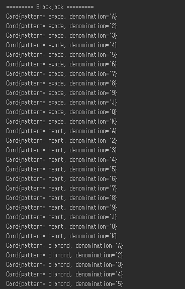
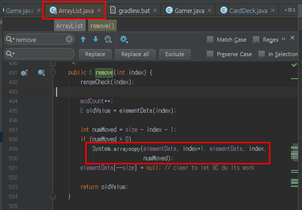
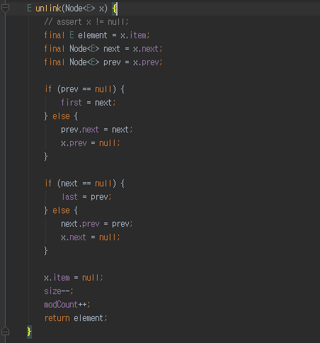

# 순수 Java로 이루어진 프로젝트
객체지향을 이해하는데 있어 웹은 좋은 예제가 아니라는 자바지기(박재성님)의 이야기에 시작한 프로젝트 <br/>


Java로 웹을 한다고 하면서 실제로 Java와 객체지향을 공부한적이 없던것 같아 데이터베이스, Html을 전혀 사용하지 않고 Java와 객체에 좀 더 집중할 예정입니다.. <br/>
추가로 Git과 Gradle을 연동하였습니다. <br/>
Java/Spring/Git/Gradle을 분리해서 생각하지 못하는 분들도 있고 Apache Commons Util이나 ObjectMapper 같은 경우는 프로젝트 목적에 크게 위배되지 않는다고 판단했습니다. <br/>
각자의 취향에 따라 Git -> Svn, Gradle -> Maven 으로 변경해도 무방할 것 같습니다.

### 주제
블랙잭 게임([나무위키](https://namu.wiki/w/%EB%B8%94%EB%9E%99%EC%9E%AD(%EC%B9%B4%EB%93%9C%EA%B2%8C%EC%9E%84)) 참고)을 개량해서 구현할 예정입니다. <br/>
블랙잭 규칙 전부를 구현하는건 지나친 감이 있어서 조금은 스펙아웃하였습니다. <br/>
화면 구성은 모두 콘솔로 진행할 예정입니다..

### 블랙잭 규칙
* 딜러와 게이머 단 2명만 존재한다.
* 카드는 조커를 제외한 52장이다. (즉, 카드는 다이아몬드,하트,스페이드,클럽 무늬를 가진 A,2~10,K,Q,J 으로 이루어져있다.)
* 2~10은 숫자 그대로 점수를, K/Q/J는 10점으로, **A는 1과 11 둘 중 하나로** 계산할 수 있다.
* 딜러와 게이머는 순차적으로 카드를 하나씩 뽑아 각자 2개의 카드를 소지한다.
* 게이머는 얼마든지 카드를 추가로 뽑을 수 있다.
* 딜러는 2카드의 합계 점수가 16점 이하이면 반드시 1장을 추가로 뽑고, 17점 이상이면 추가할 수 없다.
* 양쪽다 추가 뽑기 없이, 카드를 오픈하면 딜러와 게이머 중 소유한 카드의 합이 21에 가장 가까운 쪽이 승리한다.
* 단 21을 초과하면 초과한 쪽이 진다.

### 설계원칙

* 클래스 우선이 아닌, 객체의 속성과 행위가 우선이다.
  - 클래스는 객체를 추상화하는 도구일 뿐이다.

* 데이터가 아닌 메세지(행위)를 중심으로 객체를 설계해라.
  - 객체는 혼자 있을 수 없다. 다른 객체와의 **협력** 안에서만 존재할 수 있다.
  - 메세지를 중심으로, 해당 메세지가 어떤 객체를 필요로 하는지를 생각하자.

* 하나하나 지시하지 말고 요청해라.
  - 예를들어, 판사가 증인에게 1) 목격했던 장면을 떠올리고, 2) 떠오르는 시간을 순서대로 구성하고, 3) 말로 간결하게 표현해라 라고 요청하지 않는다. 그냥 "증언하라" 라고 요청한다.
  - 마찬가지로 객체의 설계단계에서도 책임이 있는 객체에 요청만 하도록 설계한다.

* 하나의 메소드는 하나의 일만 해야한다.

* 처음부터 완벽한 설계는 없다.
  - 설계를 구현해나가며 결과에 따라 설계를 수정할 수 도 있다.
  
### 주요 객체
* 카드뭉치 (카드덱)
* 카드
* 규칙
* 딜러
* 게이머

### 주요 객체들의 속성과 역할
* 카드뭉치 (카드덱)
  - 52개의 서로 다른 카드를 갖고 있다.
  - 카드 1개를 뽑아준다.

* 카드
  - 다이아몬드, 하트, 스페이드, 클럽 중 1개의 무늬를 가지고 있다.
  - A,2~10,K,Q,J 중 하나를 가지고 있다.

* 규칙
  - 점수를 측정해준다.
  - 승패를 판단한다.

* 딜러
  - 추가로 카드를 받는다.
  - 단, 2카드의 합계 점수가 16점 이하이면 반드시 1장을 추가로 뽑고, 17점 이상이면 받을 수 없다.
  - 뽑은 카드를 소유한다.
  - 카드를 오픈한다.

* 게이머
  - 추가로 카드를 받는다.
  - 뽑은 카드를 소유한다.  
  - 카드를 오픈한다.

### 1. 추상화된 코드 구현
위의 "객체들의 속성과 역할"에 따라 간략하게 코드를 구현하면 아래와 같습니다. <br/>

**Card.java** <br/>
```
public class Card {
    private String pattern;
    private String denomination;

    public String getPattern() {
        return pattern;
    }

    public void setPattern(String pattern) {
        this.pattern = pattern;
    }

    public String getDenomination() {
        return denomination;
    }

    public void setDenomination(String denomination) {
        this.denomination = denomination;
    }
}

```
Card의 pattern은 무늬를, denomination는 끗수(A,2~10,J,Q,K)를 얘기합니다. <br/>
<br/>

**CardDeck.java** <br/>
```
public class CardDeck {
    private List<Card> cards;

    public Card getCard(){
        return null;
    }
}
```

**Dealer.java** <br/>
```
public class Dealer {
    private List<Card> cards;

    public void receiveCard(Card card) {}

    public List<Card> openCards(){
        return null;
    }
}
```

**Gamer.java** <br/>
```
public class Gamer {
    private List<Card> cards;

    public void receiveCard(Card card) {}

    public List<Card> openCards(){
        return null;
    }
}

```

**Rule.java** <br/>
```
public class Rule {
    public int getScore(List<Card> cards){
        return 0;
    }    
    public void getWinner(Dealer dealer, Gamer gamer){}
}
```

return 타입이 void가 아닌 경우엔 null을 리턴하도록 하였습니다. <br/>
위 선언된 5개의 Java파일만으로는 블랙잭 게임이 진행될 순 없습니다. <br/>
실제로 게임을 진행시킬 Game.java를 구현해보겠습니다.<br/>

**Game.java** <br/>
```
public class Game {

    public void play(){
        System.out.println("========= Blackjack =========");
        Dealer dealer = new Dealer();
        Gamer gamer = new Gamer();
        Rule rule = new Rule();
        CardDeck cardDeck = new CardDeck();
    }
}
```

게임에 필요한 "클래스들의 인스턴스"를 생성시켰습니다. <br/>
(객체가 아닌, xx클래스의 인스턴스입니다.) <br/>
그리고 이를 실행시킬 Application.java입니다. <br/>

**Application.java** <br/>
```
public class Application {
    public static void main(String[] args) {
        Game game = new Game();
        game.play();
    }
}
```

### 2-1. 실제 코드 구현 (CardDeck)
이제 좀 더 구체화된 코드를 작성해보겠습니다. <br/>
첫번째 카드를 뽑기 위해 play에 아래 코드를 추가하겠습니다.

```
Card card = cardDeck.draw();
```

CardDeck.draw가 실제로 카드를 뽑아줘야 하기 때문에 코드를 구체화 시켜야 합니다. <br/>
draw는 CardDeck의 유일한 역할인 **남아 있는 카드 중 랜덤한 1개의 카드를 준다** 입니다. <br/>
즉, CardDeck은 본인의 역할을 수행하기 위해 **52개의 서로 다른 카드가 존재** 해야만 합니다. <br/>
생성 되는 시점에는 이 조건을 만족해야만 하기 때문에 **생성자** 를 사용하겠습니다.<br/>

**CardDeck.java** <br/>
```
    private static final String[] PATTERNS = {"spade", "heart", "diamond", "club"};
    private static final int CARD_COUNT = 13;

    public CardDeck() {
        cards = new ArrayList<>();

        for(String pattern : PATTERNS){
            for(int i=1; i<=CARD_COUNT; i++) {
                Card card = new Card();
                String denomination;

                if(i == 1){
                    denomination = "A";
                }else if(i == 11){
                    denomination = "J";
                }else if(i == 12){
                    denomination = "Q";
                }else if(i == 13){
                    denomination = "K";
                }else {
                    denomination = String.valueOf(i);
                }

                card.setDenomination(denomination);
                card.setPattern(pattern);
                cards.add(card);
            }
        }
    }
```

아주 빠르게 코드를 작성하면 위와 같이 작성할 수 있을것 같습니다. <br/>
현재 코드에서는 몇가지 개선할 것들이 보입니다. <br/>
카드의 끗수(denomination)를 결정하는 부분은 생성자의 역할이 아닙니다. <br/>
즉, 1~13 이라는 숫자를 통해 끗수를 정하는 것은 다른 메소드에서 해야할 일입니다. <br/>
그래서 numberToDenomination 라는 메소드를 통해 이 역할을 분리하겠습니다. <br/>

```
    private static final String[] PATTERNS = {"spade", "heart", "diamond", "club"};
    private static final int CARD_COUNT = 13;

    public CardDeck() {
        cards = new ArrayList<>();

        for(String pattern : PATTERNS){
            for(int i=1; i<=CARD_COUNT; i++) {
                Card card = new Card();
                String denomination = this.numberToDenomination(i);
                card.setDenomination(denomination);
                card.setPattern(pattern);
                cards.add(card);
            }
        }
    }

    private String numberToDenomination(int number){

        if(number == 1){
            return "A";
        }else if(number == 11){
            return "J";
        }else if(number == 12){
            return "Q";
        }else if(number == 13){
            return "K";
        }

        return String.valueOf(number);
    }
```

자 여기서 추가로, Card의 인스턴스를 생성하고 뒤에 set메소드를 통해 끗수(denomination)와 무늬(pattern)를 지정하는 코드를 개선해보겠습니다. <br/>
<br/>
**Card.java**
```
    private String pattern;
    private String denomination;

    public Card(String pattern, String denomination) {
        this.pattern = pattern;
        this.denomination = denomination;
    }

    public String getPattern() {
        return pattern;
    }

    public void setPattern(String pattern) {
        this.pattern = pattern;
    }

    public String getDenomination() {
        return denomination;
    }

    public void setDenomination(String denomination) {
        this.denomination = denomination;
    }
```

**CardDeck.java**
```
    private static final String[] PATTERNS = {"spade", "heart", "diamond", "club"};
    private static final int CARD_COUNT = 13;

    public CardDeck() {
        cards = new ArrayList<>();

        for(String pattern : PATTERNS){
            for(int i=1; i<=CARD_COUNT; i++) {
                String denomination = this.numberToDenomination(i);
                Card card = new Card(pattern, denomination);
                cards.add(card);
            }
        }
    }
```

기본 생성자+set메소를 사용하지 않고, 인자가 추가된 생성자를 사용한 이유는 무엇일까요? <br/>
(참고로 Java는 생성자가 없으면 기본생성자가 자동 추가되며, 별도의 생성자가 추가되면 기본생성자가 추가되지 않습니다.) <br/>

* 끗수와 무늬를 가지고 Card가 어떤 행위를 하는지 CardDeck은 몰라도 된다.
  - 즉, Card에서 끗수와 무늬를 마음대로 활용하더라도 CardDeck은 아무런 영향이 없다.
* Card는 끗수와 무늬가 필수임을 강제할 수 있다.
  - Card에 기본 생성자가 있으면 **끗수와 무늬가 없는 Card가 생성** 될 수 있다.
  - 하지만 이렇게 하게 되면 **끗수와 무늬가 없는 Card는 생성 될 수 없다**

<br/>

자 그럼 CardDeck이 잘 생성되는지 확인하기 위해 간단하게 출력을 시켜보겠습니다. <br/>

**Card.java**
```
    @Override
    public String toString() {
        return "Card{" + "pattern='" + pattern + ", denomination='" + denomination + '}';
    }
```

**CardDeck.java**
```
    @Override
    public String toString() {
        StringBuilder sb = new StringBuilder();

        for(Card card : cards){
            sb.append(card.toString());
            sb.append("\n");
        }

        return sb.toString();
    }
```

**Game.java**
```
    public void play(){
        System.out.println("========= Blackjack =========");
        Scanner sc = new Scanner(System.in);

        Dealer dealer = new Dealer();
        Gamer gamer = new Gamer();
        Rule rule = new Rule();
        CardDeck cardDeck = new CardDeck();
        
        System.out.println(cardDeck.toString());
    }
```

위 코드를 통해 Application.java를 실행시키면!



이렇게 52개의 서로 다른 카드가 생성되었음을 확인할 수 있습니다. <br/>
바로 draw기능을 만들어 보겠습니다. <br/>
draw는 2가지를 해야 합니다. <br/>

* 남아 있는 카드 중 1개를 뽑는다.
* 뽑은 카드는 카드덱에서 제거한다.

이걸 간단하게 구현하면 아래와 같은 코드가 됩니다. <br/>

```
    public Card draw(){
        int size = cards.size();
        int select = (int)(Math.random()*size);
        Card selectedCard = cards.get(select);
        cards.remove(select);
        return selectedCard;
    }
```

코드를 작성한 것을 보면 몇가지 개선할 것이 있습니다. <br/>
remove 기능은 랜덤하게 뽑힌 카드를 제거 하는 작업입니다. <br/>
현실에서는 이 작업이 크게 어려운일이 아니지만, 코드속에서는 이 작업은 List별로 구현 방식이 큰 차이가 발생합니다.

**ArrayList** <br/>



ArrayList의 remove는 해당 인덱스의 인스턴스를 제거하고 **남은 데이터들을 다시 Copy 합니다.** <br/>
즉, ArrayList는 중간중간 인스턴스를 제거하는 것은 결코 좋은 성능을 내지 못하는 것입니다. <br/>
반면에 LinkedList의 경우는 remove를 아래와 같이 합니다. <br/>

**LinkedList** <br/>




LinkedList의 remove와 remove에서 사용되는 unlink 메소드의 코드입니다. <br/>
보시는것처럼 LinkedList의 remove는 해당 node와 연결을 맺고 있는 앞 뒤 node의 연결을 끊어버림으로써 remove를 하게됩니다. <br/>
즉, 중간중간 인스턴스의 제거 혹은 추가의 경우는 LinkedList가 ArrayList보다 훨씬 더 좋은 성능을 보이게 됩니다. <br/>
(좀 더 상세하게 알고 싶으시다면 [넥스트리의 블로그](http://www.nextree.co.kr/p6506/)를 추천드립니다. )<br/>
자 그럼 CardDeck의 cards를 LinkedList로 교체하겠습니다. <br/>

```
cards = new LinkedList<>();
```

List라는 **인터페이스로 cards를 선언** 하였기에 구현체가 ArrayList가 되든, LinkedList가 되든 다른 코드를 수정할 필요가 없습니다. <br/>
그리고 현재 draw에는 남아있는 카드들 중 하나를 뽑는 것과, 카드를 제거하는 것 2가리르 동시에 하고 있기에 <br/>
이를 분리하겠습니다.

```
    public Card draw(){
        Card selectedCard = getRandomCard();
        cards.remove(selectedCard);
        return selectedCard;
    }

    private Card getRandomCard() {
        int size = cards.size();
        int select = (int)(Math.random()*size);
        return cards.get(select);
    }
```

다른 메소드와 달리 getRandomCard는 접근 제한자를 private로 하였습니다. <br/>
private 접근 제한자는 해당 클래스외에는 접근할 수가 없습니다. <br/>
그래서 외부에서 사용되지 않는 변수/메소드들은 private 접근제한자를 사용하여 타인이 코드만 보고도, 
**해당 변수/메소드는 현재 클래스에서만 사용된다는 것을 명시** 하는 것이 더 좋습니다. <br/>
<br/>
여기까지 CardDeck을 구현하였습니다. <br/>
차근차근 나머지 객체들 역시 진행하겠습니다. <br/>

### 2-2. Gamer & Dealer 구현
Gamer의 역할은 아래와 같습니다. <br/>
* 추가로 카드를 받는다.
* 뽑은 카드를 소유한다.
* 카드를 오픈한다.

receiveCard와 cards를 담을 구현체를 생성자에 추가하였습니다. <br/>

```
public class Gamer {
    private List<Card> cards;

    public Gamer() {
        cards = new ArrayList<>();
    }

    public void receiveCard(Card card) {
        this.cards.add(card);
    }

    public List<Card> openCards(){
        return null;
    }
}
```

Gamer의 경우 사용자가 현재 카드들의 총 Point를 보며 카드를 더 뽑을지 말지를 결정하게 됩니다. <br/>
이를 위해서는 Gamer는 **현재 카드들을 확인** 할 수 있어야 합니다. <br/>
그래서 showCards라는 메소드를 통해 이 기능을 구현하겠습니다. <br/>
**showCards는 Gamer의 역할** 입니다. Gamer가 소유한 카드들의 목록을 보여주는 것이기 때문입니다. <br/>

```
    public void showCards(){
        StringBuilder sb = new StringBuilder();
        sb.append("현재 보유 카드 목록 \n");

        for(Card card : cards){
            sb.append(card.toString());
            sb.append("\n");
        }

        System.out.println(sb.toString());
    }
```

매번 System.out을 하는 것은 성능상 좋지 않기 때문에 StringBuilder로 출력결과를 모두 작성후 **최종 1번만 System.out** 할 수 있도록 하였습니다.
(여담으로 알고리즘 문제 사이트에서 결과를 출력하실 경우에도 이렇게 하시는게 결과시간 단축에 도움이 됩니다.) <br/>

추가로 openCards 메소드는 현재 갖고 있는 모든 카드들을 전달하는 역할이기 때문에 아주 쉽게 구현이 됩니다. <br/>
```
    public List<Card> openCards(){
        return this.cards;
    }
```

자 그럼 여기까지 구현된 Gamer를 통해 Game.play 메소드 내용을 작성해보겠습니다. <br/>


Dealer의 역할은 아래와 같습니다. <br/>

* 추가로 카드를 받는다.
* 단, 2카드의 합계 점수가 16점 이하이면 반드시 1장을 추가로 뽑고, 17점 이상이면 받을 수 없다.
* 뽑은 카드를 소유한다.
* 카드를 오픈한다.

이렇게 될 수 있었던 이유는 게임의 승패를 판단하는 것은 Rule 객체가, 카드를 뽑는 것은 카드덱 객체가 맡았기 때문입니다. <br/>
그럼 위 역할들만 구현해보겠습니다.

  
### 참고 자료
* [조영호님의 객체지향의 사실과 오해](http://www.yes24.com/24/goods/18249021)
* [OKKY fender님의 칼럼](http://okky.kr/article/358197)
